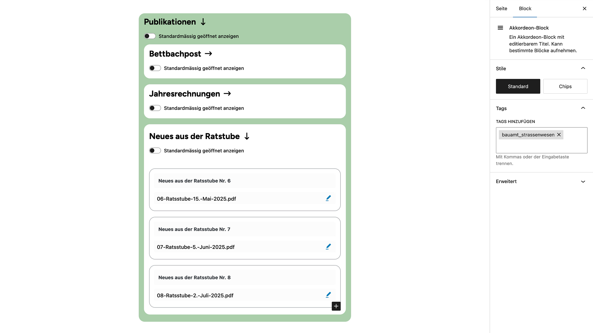

# UD Block: Accordion

Interaktiver Akkordeon-Block für den WordPress-Block-Editor.
Er ermöglicht ein- und ausklappbare Inhalte mit editierbarem Titel und optional geöffneter Startansicht.

## Funktionen
- Ein- und ausklappbare Bereiche mit sanfter Animation
- Editierbarer Titel (`title`) und Option „initiallyOpen“
- Auswahl erlaubter Blöcke über Plugin-Einstellungen
- Getrennte Editor- und Frontend-Skripte für Performance
- Voll kompatibel mit Full Site Editing (FSE)

## Screenshots

*Abbildung: Frontend-Ansicht - das Akkordion erlaubt es auch, verschachtelt zu werden.*

*Abbildung: Editor-Ansicht des verschachtelten Accordions.*

## Autor

[ulrich.digital gmbh](https://ulrich.digital)

---

## Lizenz

GPL v2 or later
[https://www.gnu.org/licenses/gpl-2.0.html](https://www.gnu.org/licenses/gpl-2.0.html)

<!--
Interne Verwendung:
Eingesetzt in den Projekten
- illgau.ch
- schule.illgau.ch
- bbzg.ch
-->
